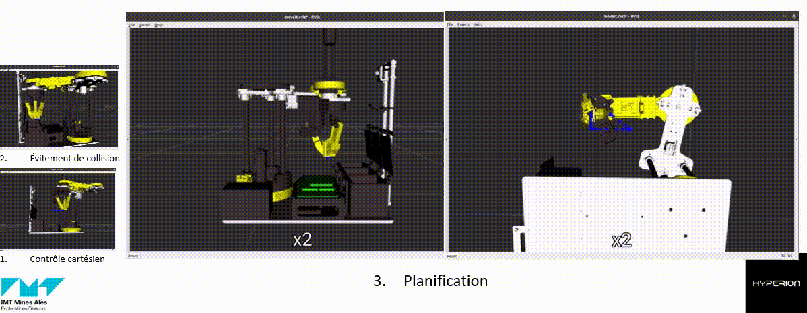

# Hyperion



# Architecture Informatique


## Installation ros noetic :
```sh
sudo sh -c 'echo "deb http://packages.ros.org/ros/ubuntu $(lsb_release -sc) main" > /etc/apt/sources.list.d/ros-latest.list'
sudo apt install curl
curl -s https://raw.githubusercontent.com/ros/rosdistro/master/ros.asc | sudo apt-key add -
sudo apt update
sudo apt install ros-noetic-desktop-full
echo "source /opt/ros/noetic/setup.bash" >> ~/.bashrc
source ~/.bashrc
sudo apt install python3-rosdep python3-rosinstall python3-rosinstall-generator python3-wstool build-essential
sudo rosdep init
rosdep update
```
## Création d’espace de travail :
```sh
mkdir -p ~/catkin_ws/src
cd ~/catkin_ws/
catkin_make
echo "source ~/catkin_ws/devel/setup.bash" >> ~/.bashrc
```
## Installation moveit : 
```sh
sudo apt install ros-noetic-moveit
wstool init .
wstool merge -t . https://raw.githubusercontent.com/ros-planning/moveit/master/moveit.rosinstall
wstool remove moveit_tutorials
wstool update -t .
cd ~/catkin_ws/src
git clone https://github.com/ros-planning/moveit_tutorials.git -b master
git clone https://github.com/ros-planning/panda_moveit_config.git -b noetic-devel
cd ~/catkin_ws/src
rosdep install -y --from-paths . --ignore-src --rosdistro noetic
sudo sh -c 'echo "deb http://packages.ros.org/ros-testing/ubuntu $(lsb_release -sc) main" > /etc/apt/sources.list.d/ros-latest.list'
sudo apt update
```
## Installation des dépendances du projet :
```sh
sudo apt install ros-noetic-cv-bridge
sudo pip install can customtkinter pygame RPi.GPIO opencv-python
```
## Mise en place du projet :
```sh
cd ~/catkin_ws/src
git clone https://github.com/luewh/hyperion_repo.git
rm -r ihm joystick klampt moveit_hyperion moveit_liquide # Raspberry Pi seulement
cd ~/catkin_ws/
catkin_make
source ~/.bashrc
```
## Démarrage
Configurer le poste de pilotage comme ROS master et le Raspberry Pi le ROS client.   
Commencer démarrage du poste de pilotage d’abord en entrant les commandes dans l’ordre, puis ceux du Raspbery Pi.
### Poste de pilotage
```sh
roslauch moveit_hyperion demo.launch
roslauch vision imsubscriber.launch
rosrun joystick test_move_groupe_joystick.py
rosrun ihm SYSMAP_Main_IHM.py
```
### Raspbery Pi
```sh
rosrun motor gpio.py
rosrun communication_can can_send.py
roslaunch vision impublisher.launch
```